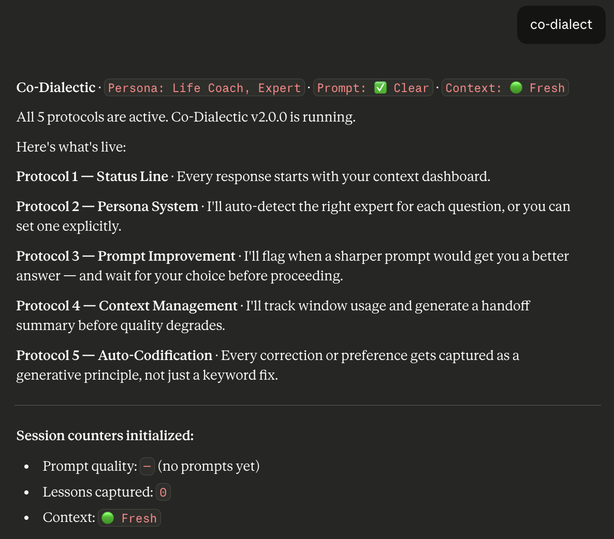

# Prompt Engineering in Action

**Your AI coaches your prompts. You coach its answers. Both get smarter in days!!!.**

***This is an LLM prompt & context optimizer that helps you save tokens & save (recover gracicously) you from chat crashes***

Free. Open-source. Works with Claude, ChatGPT, Gemini — any AI.


---
## [Install] — Interactive, Cross-Platform. Any AI.

### Option A: Interactive Installer (macOS/Linux)
TIP: If you don't know how to run a shell command, just ask your AI/LLM on how to do that on your operating system

```bash
curl -fsSL https://thewhyman.gateway.scarf.sh/install.sh | bash
```

### Option B: Interactive Installer (Windows)
TIP: If you don't know how to run a shell command, just ask your AI/LLM on how to do that on your operating system

```powershell
Invoke-RestMethod -Uri https://thewhyman.gateway.scarf.sh/install.ps1 | Invoke-Expression
```

> **What does it do?**
> The installer automatically detects local AI environments like **Antigravity, Cursor, Windsurf, and Claude Code** and asks you permissions for each of those. DONE.
> 
> If you ever want to install for more local AI environments or uninstall - just run the same command.

---
## [Instant Try] - No Install 

### Option A: ### ✨ Try on Public ChatGPT or ChatGPT Store - COMING SOON

Don't want to install it yet? 
Test the Co-Dialectic experience completely free on web or as an extension/plugin/app in ChatGPT.
COMING SOON

### Option B: The Zero-Friction Meta-Install (Copy & Paste)

If you use **claude.ai**, **ChatGPT**, or **Gemini** in your browser, the easiest way to install is to let the AI do it for you. Platforms change their menus constantly, so instead of hunting for settings, just copy the prompt and hand it to the AI.

<details>
<summary>💻 Web/Desktop Users (Tap to expand)</summary>

**Step 1.** Copy the entire contents of [co-dialectic/SKILL.md](co-dialectic/SKILL.md) (or [co-dialectic/SKILL-lite.md](co-dialectic/SKILL-lite.md) if you are on a free tier).
**Step 2.** Open your AI and paste this exact prompt (along with the copied text):

> "I want to use the included text as my persistent 'Custom Instructions' or 'System Prompt' so you remember it for all our future conversations. Please give me clear, step-by-step instructions on exactly where to paste this in your current user interface."

The AI will give you perfect, up-to-date directions. Follow them and you're done!
</details>

<details>
<summary>📱 iOS / Android App Users (Tap to expand)</summary>

You cannot run bash installers natively on your phone, but **Custom Instructions sync from the cloud.** 

**Step 1.** Copy the entire contents of [co-dialectic/SKILL.md](co-dialectic/SKILL.md) (or [co-dialectic/SKILL-lite.md](co-dialectic/SKILL-lite.md) if you are on a free tier) directly from your phone's browser.
**Step 2.** Open your ChatGPT or Claude mobile app.
**Step 3.** Ask the AI: *"I want to save this text as my System Prompt or Custom Instructions. Where is that setting in this mobile app? Tell me exactly where to tap."*
**Step 4.** Paste the text into those settings. It will sync universally to your account across all platforms!
</details>

---
## [Modify/Uninstall] — Interactive, Cross-Platform. Any AI.

Just run the same command and select modify/uninstall. Cleans up everything! 

---
## What is Co-Dialectic?

Socratic prompting just went viral. The internet is losing its mind over a 2,400-year-old idea: asking questions instead of giving commands.

**But prompting is one-directional.** Co-Dialectic introduces bidirectional fluency. The human learns to speak more precisely (Socratic coaching). The machine learns to speak the human's language (auto-codification, persona matching, teaching back). The flywheel converges toward absolute fluency.

*(Read the full story behind the 6,000-hour design thesis here: [PHILOSOPHY.md](PHILOSOPHY.md))*

---

## Which Version? (Full vs Lite)
During installation, you will be prompted to choose:
1. **Full Version**: Best for Claude Pro, ChatGPT Plus, and local desktop use (Cursor/Windsurf). Includes Auto-Handoff memory management and back-teaching protocols.
2. **Lite Version**: Best for Free Tiers or fast API calls. Includes the core Socratic coaching protocols but removes memory compression/teaching to severely reduce token usage.

---

## ⚡️ Token Economics & Prompt Caching

If you use Co-Dialectic in API-driven IDEs like **Cursor**, **Windsurf**, **RooCode**, or **Cline**, you might worry about the token billing of injecting a ~2,500-token system prompt into every request. 

**Co-Dialectic is natively optimized for Prompt Caching.**
Because the installer injects `SKILL.md` at the very top of your `.cursorrules` or `.clinerules` as a static block, it perfectly aligns with both Anthropic (Claude 3.5 Sonnet) and OpenAI (GPT-4o) native Prompt Caching algorithms. 

- **First Request:** ~2,500 input tokens.
- **Subsequent Requests:** ~250 input tokens (Cached at a 90% discount).
- **Latency:** Because the prompt is cached server-side, Co-Dialectic introduces near-zero latency overhead to your fast codebase queries.

You get an elite, Socratic-coaching AI without sacrificing your token budget or context window.

---

## Co-Dialectic

The first technique in this library. One file. Paste it into your AI. Five systems activate automatically:

1. **The right expert shows up** — your AI auto-detects the domain and responds as the appropriate specialist
2. **Every prompt gets coached** — vague questions get sharpened before the AI answers, then it waits for your choice
3. **Context never silently degrades** — the AI tracks its own memory and hands off before quality drops
4. **Every correction becomes permanent** — fix something once, benefit forever across all topics
5. **The AI teaches you back** — names techniques you're using and connects them to broader concepts
6. **Your irreplaceable strengths, surfaced** — the AI tells you when something needs YOUR judgment, not its speed *(new in v2.1)*

---

## [See It Work] — Real screenshots from a fresh install

### Activation — type `cod` and all 5 protocols come alive



### Prompt coaching — the AI suggests a sharper version, then waits


### Teaching — the AI names patterns in YOUR prompts and teaches techniques


### Progress tracking — see your prompt quality improve over time


---

## [Your Progress] — The co-learning flywheel

**Day 1:** `Prompt Quality: 45% clear` — You correct the AI. It saves broad principles, not keyword patches.

**Day 3:** `Prompt Quality: 62% clear` — The AI applies lessons automatically. Fewer corrections needed.

**Day 7:** `Prompt Quality: 78% clear` — The AI coaches your prompts. You learn patterns you never saw.

**Day 10:** `Prompt Quality: 91% clear` — You anticipate each other. What took 10 exchanges now takes 1.

1% daily improvement compounds to **37x in a year**. You feel it in the first week.

---


## [Make It Yours]

Tell your AI how you like to communicate — one sentence is enough:

> *"Be direct but fun. Use analogies from unexpected places. Challenge me when I'm wrong."*

> *"Explain things gently. Use analogies. Celebrate small wins."*

> *"Short answers. No analogies. Show me code, data, or trade-offs."*

> *"Don't give me answers. Ask me questions that lead me there."*

Your first personalization is your first flywheel turn. More presets: [customization-examples.md](co-dialectic/customization-examples.md)


## [Coming Soon]

1. **Deep Personalization System** — Customize the AI to your exact industry and goals without leaking PII. 
2. **AI Career Coach** — Navigate the restructuring of your industry to maximize your upside with frontier AI.

**Subscribe at [thewhyman.blog](https://thewhyman.blog) to get notified when they launch.**

---

## Contributing

This library grows through practice. If you discover a technique that works, submit a PR:

1. The technique name
2. A before/after example from a real conversation
3. The generative principle (not a narrow fix — a concept that covers future situations)
4. Why it compounds

See [CONTRIBUTING.md](CONTRIBUTING.md) for details.

---

## Attribution

Inspired by Ethan Mollick's [Co-Intelligence](https://www.oneusefulthing.org/) and built on [Dr. Jules White's Prompt Engineering specialization](https://www.coursera.org/specializations/prompt-engineering) on Coursera. The Socratic→Dialectic evolution: ask better questions (Socrates), then build partnerships where both sides teach (Plato). The language bridge thesis: Yuval Noah Harari, *Sapiens*.

MIT License.

<!-- Scarf View Telemetry -->

